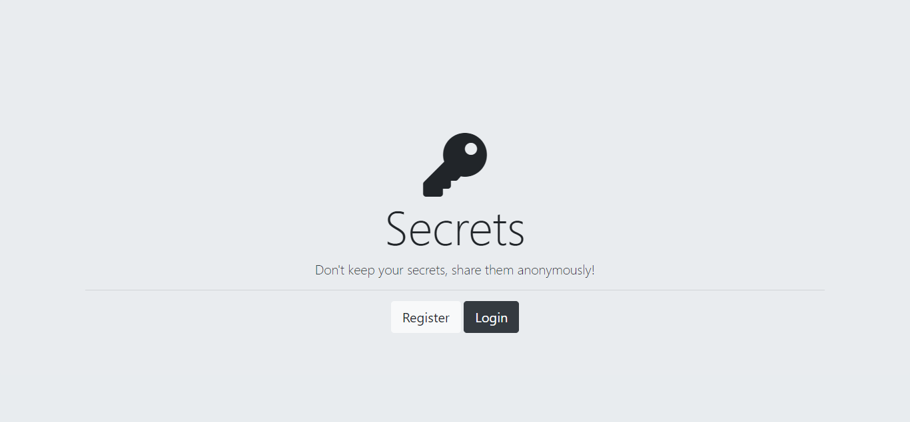
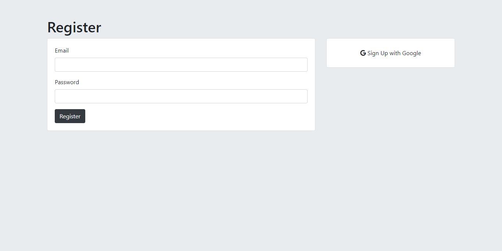
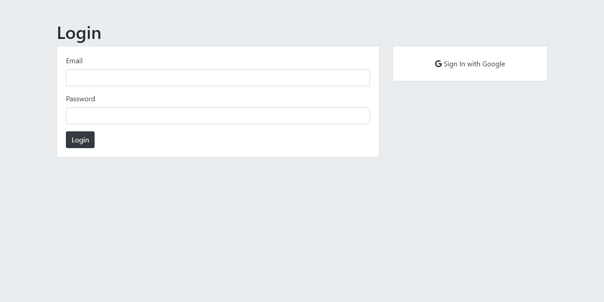
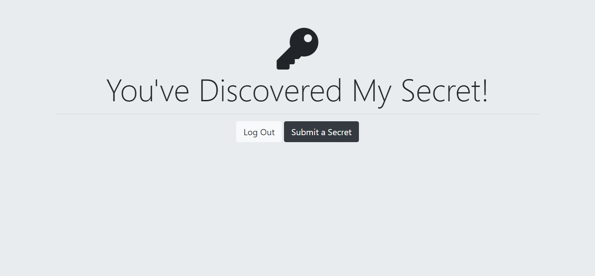
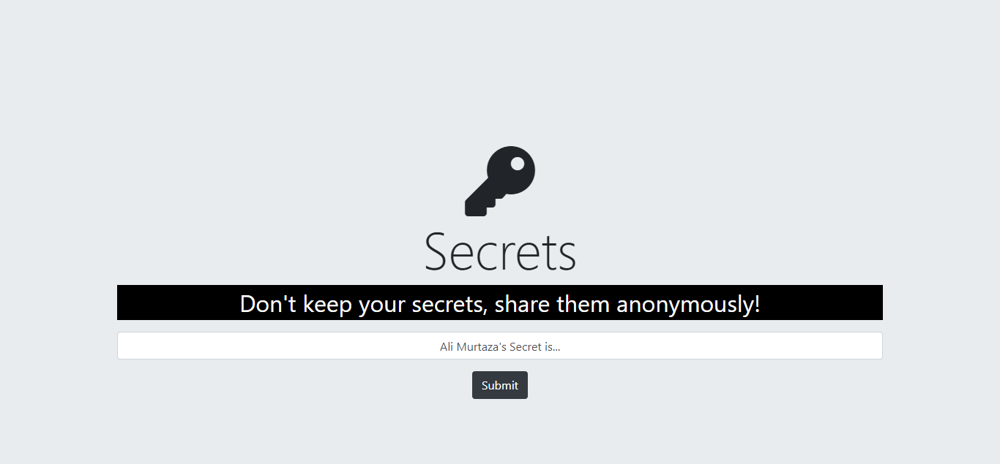
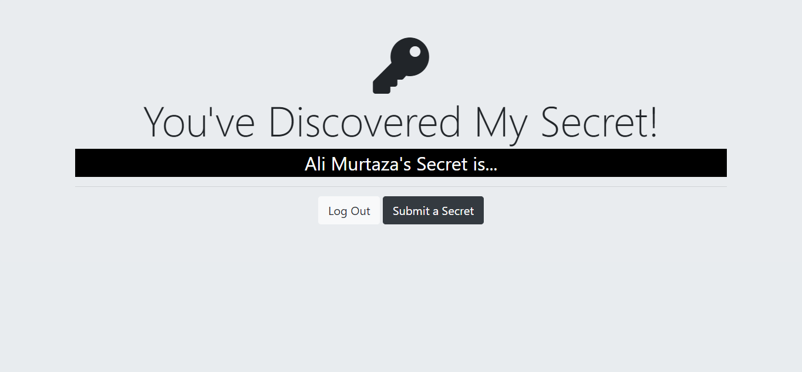

# web-authentication-and-security-storing-secrets-application
A simple web application that providers different levels of encryption, so that user can store their secrets.

New user have to first register him/herself, their are two options: 1. With New Email 2. With Google Auth.
After that he/she can write their secrets that will be store inside mongoDB database and will be safe their.

# Project Mockups

